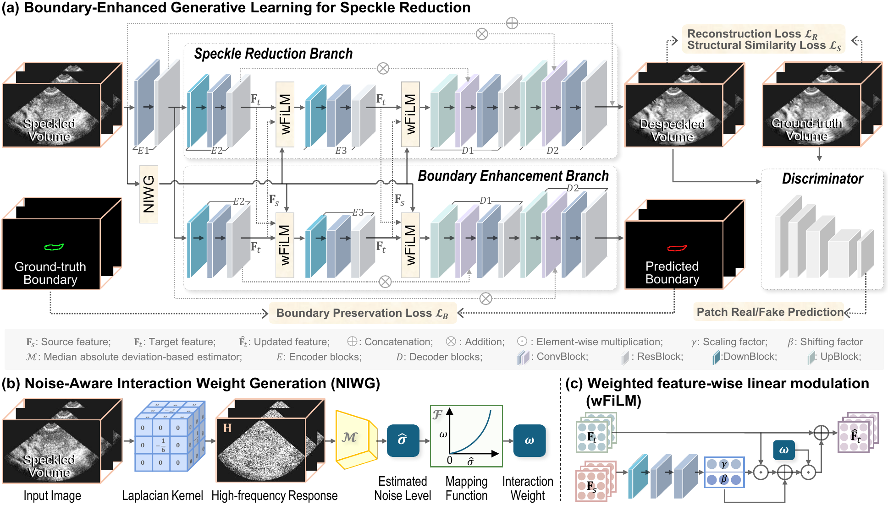

# NBGL

Noise-Aware Boundary-Enhanced Generative Learning for 3D ultrasound speckle reduction.

## Method overview



[Download the method flowchart PDF](docs/NBGL_pipeline_v6.pdf)

## Repository contents

- `NBGL.py`: training, validation, and test pipeline.
- `requirements.txt`: Python dependencies.

Large source datasets and NIfTI volumes are intentionally excluded from Git.
Checkpoints and generated result summaries are stored under `NBGL_Blind_Mixed_Noise/`.

## Data

This project uses the UterUS dataset:

https://github.com/UL-FRI-LGM/UterUS

After downloading the data, place it under:

```text
Databases/
```

## Checkpoints and artifacts

Place checkpoints or generated artifacts under:

```text
NBGL_Blind_Mixed_Noise/
```
